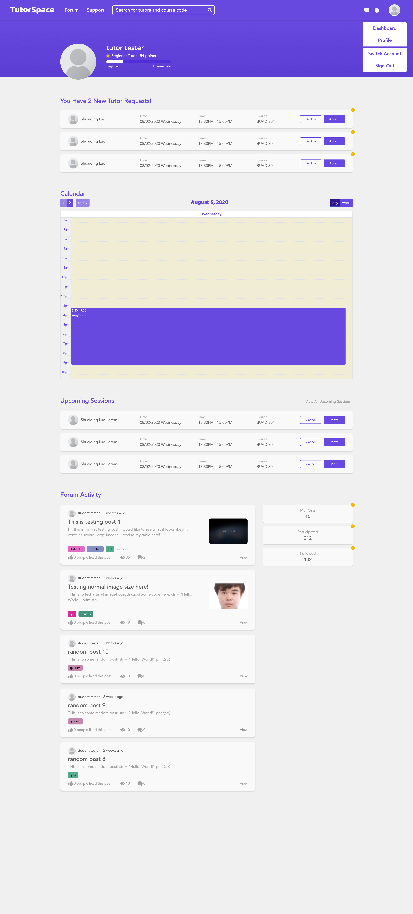
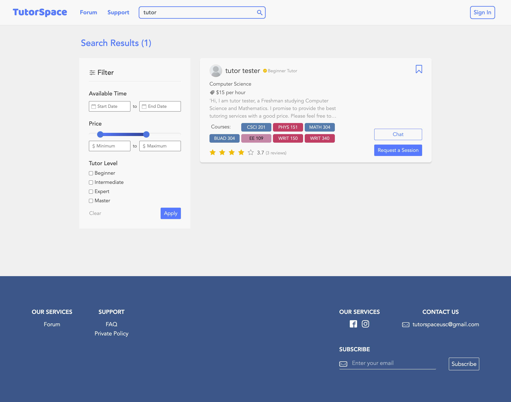

# TutorSpace

## Website: https://tutor.joinme.us/

## Sample Tutor Account:
```
Email: sophiap@usc.edu
Password: 123
```

## Sample Student Account:
```
Email: shuaiqin@usc.edu
Password: 123
```

## Screenshots
### 1. Index Page:


### 2. Singup Wizard:


### 3. Home Page (Student):


### 4. Home Page (Tutor):


### 5. Chatting Page:


### 6. Edit Availability Page (Tutor):


### 7. Profile Page (about you):


### 8. Profile Page (bookmarks):


### 9. Profile Page (reviews):


### 10. Profile Page (write reviews):


### 11. Profile Page (sessions):


### 12. Write Post:


### 13. Search Page:


### 14. Report Tutor Page:


## Completed functionalities:
1. Login / Signup 
2. Q&A Dashboards
    * Post Filter
    * Adding new posts
3. Edit availability in Calendar (Tutor)
4. View tutor’s availability and make tutor requests (Student)
5. Accept/Decline tutor requests (Tutor)
    * Accepted tutor requests will become upcoming sessions
6. Searching
    * Search with Filters
        * Year
        * Rating
        * Price
        * Availability
    * Search by Keyword
        * Name
        * Course
        * Subject
7. Messaging
    * Sending messages
    * Unread messages notification
    * Pending tutor requests notification
8. Get recommended tutors for interested subjects/courses (Student)
9. Bookmark/Unbookmark users
10. View/Cancel Upcoming Tutor Sessions
    * Outdated upcoming sessions will become Past Tutor Sessions
11. Write reviews for past sessions
12. Edit Profile
    * Change basic information
    * Upload/Change profile photo
    * Add/Remove interested subjects, courses, characteristics
    * Getting all the reviews from others (Tutor)
    * Getting all the written reviews about others (Student)
13. See Past Tutors
14. Report tutors
15. View others’ profile
