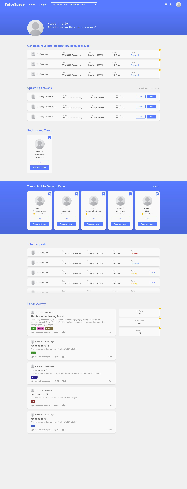

# TutorSpace

## Website: https://tutorspace.joinme.us/

## Promotion Page: https://www.tutorspace.info

## Instagram: https://www.instagram.com/tutorspaceusc/

<!-- ## Prototype project: https://tutor.joinme.us
### This prototype project is created by Shuaiqing Luo in Spring 2020 and is already fully functional. Wishing to build the largest tutor matching service platform in California that provides best user experience, he decided to revamp all the frontend design and backend functionalities, which then turned into the current product of TutorSpace. 

### TutorSpace has gathered a group of professional and passionate developers, designers, and marketing specialists. If you are interested in joining TutorSpace, please contact us at tutorspaceusc@gmail.com -->

## Sample Tutor Account:
```
Email: tutor@usc.edu
Password: password
```

## Sample Student Account:
```
Email: student@usc.edu
Password: password
```

> Since these two sample accounts used fake emails, you would not be able to test any email related funcitonalities in our platform (subscribing, getting notifications, verification code, etc). You would need to register on our platform using your own email.


### ======================== ***RESOURCES*** ========================
1. [**Github**](https://github.com/TutorSpace/TutorSpace)
2. [**Trello**](https://trello.com/tutorspace1/home)
3. [**Figma**](https://www.figma.com/file/5fTGR3CI0dBXJgsb7gp3ev/Tutor?node-id=0%3A1)

### ====================== ***ALL DEVELOPERS*** ======================
1. ***NEVER*** push directly to the ***MASTER*** branch. Create your own branches and make pull requests to ***DEVELOP*** branch.
2. Pull from ***DEVELOP*** branch regularly to make sure you get the most updated code. If there’s a merge conflict you don’t know how to solve, please let other developers know and we can figure it out together.
3. We are using the **Agile** methodology, so it would be best if all our developers can follow the following rules:
    1. Our sprint cycle is ***ONE WEEK***. Everyone’s tasks are listed in Trello. Remember to update the tasks before the end each sprint cycle by adding description to the tasks. Remember not to move the tasks to a different list, since we will do it together in our daily meeting. (The meeting time has yet to be decided.)
    2. Please always notify others about 1) What features/tasks have you accomplished last 1 - 3 days and 2) What features/tasks do you plan to work on next 1 - 3 days. 
        > **Please update these every 1 - 3 days in our slack room.**
4. Try ***adding comment*** to your code as much as possible
5. Avoid Repetitive Code (***DRY***)
6. If you see any bugs in our project or you have any concerns about the existing functionalities( no matter it’s frontend or backend), please report it directly in the corresponding slack channel or take a note of it and bring it up in our next weekly meeting.
7. If there is anything you did not finish yet or you want to work on later in the future, please put some comments around them with a format of `TODO: xxxxxx`
8. Important commands to run our project:
    1. Install Laravel on your local computer.
    2. First check your `.env` file exists in the root directory of the project, and the credentials inside it can either connect to your local database or the `joinmeus_tutorspace_db` database.
    3. Run `php artisan serve` and `php artisan queue:work` to start running the project. By default, you should be able to see the project by entering `localhost:8000` in your browser if the port 8000 is not occupied.
    4. Make sure you already installed `csv`, `mysql.connector`, and `load_dotenv` python packages on your computer. (To test this, simply go to `python_web_scraping` folder and run `python main.py` to see whether it reports any error. If everything works, make sure you go back to the project's root folder)
    5. Run `npm install` to install all required packages
    6. Run `npm run watch` to compile all js/css files (very useful for our ***FrontEnd*** developers)
    7. Make sure you have `python-dotenv` package installed. If not, run `pip install python-dotenv`.
    8. Run `php artisan migrate:refresh --seed` to refresh & seed the database


### ====================== ***BACKEND DEVELOPERS*** ======================
1. Debug at `localhost:8000/telescope`, where you can access the exact queries you executed and their runtime, cache, queues, scheduled tasks, .etc
2. Runtime is of our ***TOP*** priority. Try to optimize runtime using techniques like CACHE, QUEUES, EAGER LOADING, and more beyond.
3. Keep code ***STRUCTURED***
4. Please restructure/optimize existing code wherever you see a potential to improve. (***Just make sure you fully tested it after you modified the code to guarantee it really works. If you know some part of the program can be improved/optimized but dont want to modify it right away, please leave a "todo" comment near it so that we can modify it sometime in the future***)
5. Most Useful Sections in Laravel's Official Documentation: (***PLEASE READ ALL THE ONES MARKED WITH * FIRST, AS THEY ARE THE MOST IMPORTANT ONES!***)
    1. Architecture Concepts:
        1. Facades
    2. The Basics 
        1. Routing (*)
        2. Middleware (*)
        3. CSRF Protection
        4. s (*)
        5. Requests (*)
        6. Responses
        7. Views
        8. Session (*)
        9. Validation (*)
    3. Digging Deeper
        1. Cache (*)
        2. Collections
        3. Events
        4. Helpers (*)
        5. Notifications
        6. Queues
        7. Task Scheduling
    4. Database
        1. Getting Started
        2. Query Builder (*)
        3. Migrations (*)
        4. Seeding
    5. Eloquent ORM
        1. Getting Started
        2. Relationships (*)
        3. Collections (*)
        4. Mutators (*)


### ====================== ***FRONTEND DEVELOPERS*** ======================
1. Use BEM Naming Conventions
2. Try to extract all the shared common components out of a page and build blade & css files unique to those components.
3. Always plan out the page layout before writing any code. This will be helpful for responsive layout.
4. Create variables in `resources/sass` if a value will be used in many places.
5. Do not use CDN of third-party libraries. Instead, use npm to install those packages and then include the js files in `resources/js/app.js` using `require` statements (CommonJS syntax)
6. Write all js files in `resources/js` folder, and add those files into `webpack.mix.js`. Then, run `npm run watch` or `npm run dev` to compile the js files into the public folder. Finally, include the compiled js files into the `app.blade.php` if it will be shared among many files
7. Since our platform is quite large and all the pages share one single large css file, please pay special attention not to conflict with any already existing css classes by wrapping a page's main styles with a main class and defind all the styles under that main class.
8. Since our users can be guest users, student users, and tutor users, they often share same or similar components on the same page. Therefore, please first plan out which common parts they share and extract them out when building the css files.
9. Use `class` instead of `id` wherever possible for both CSS and JS files.
10. Use ***jQuery*** instead of ***vanilla JS***
11. Important Resources:
    1. [Blade Templates](https://laravel.com/docs/7.x/blade)
    2. [Bootstrap](https://getbootstrap.com/)
    3. [Bootstrap Icons](https://icons.getbootstrap.com/)
    4. [IconMoon Icons](https://icomoon.io/app/#/select)
    5. [NPM Modules](https://www.npmjs.com/)


<!-- 

## Screenshots
### Index Page:


### Login Page:


### Sign Up Page:


### Home Page - Tutor:


### Home Page - Student:


### Forum:


### Forum (post detail):


### Forum (create new post):


### Search:

 -->
